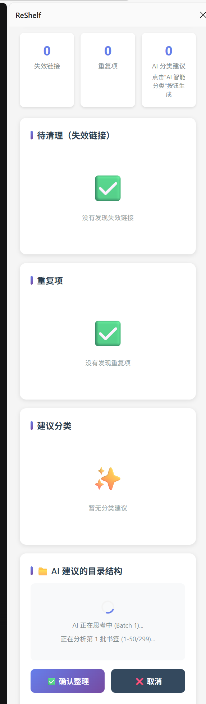

# ReShelf - AI 驱动的智能书签管理员

**ReShelf** 是一款基于大语言模型（LLM）的 Chrome 扩展程序，旨在通过 AI 技术解决书签杂乱、链接失效和信息冗余等痛点。它不仅能自动分析书签内容并进行归类，还提供了完整的健康检测与备份管理功能。

注：数据无价，建议先导出备份，有备无患

---

## 💡 API 推荐 (针对国内及免费用户)

如果您希望以零成本获得最佳的分类效果，建议使用 **OpenRouter**：
* **完全免费**：通过 OpenRouter 接口可以调用免费模型，无需支付 Token 费用。
* **配置简单**：只需在 [OpenRouter 官网](https://openrouter.ai/) 注册并创建一个 API Key，将其填入插件设置即可开始使用。
* **连通性好**：作为聚合网关，OpenRouter 在国内环境下的调用通常比直接访问部分海外官方 API 更加稳定。

---

## 🌟 核心特性

### 1. 🤖 AI 智能分类与重构
* **多模型接入**：支持 **OpenRouter**、**Google Gemini** 及 **智谱 AI**。
* **聚合度调节**：提供“低（精细）”、“中（平衡）”、“高（大类）”三种聚合模式，满足不同的整理习惯。
* **根目录操作**：直接在浏览器的“书签栏”或指定根目录下递归创建多级文件夹并移动书签。

### 2. 🔍 书签健康检测
* **失效链接扫描**：自动检测无法访问的 HTTP/HTTPS 链接，并支持一键清理。
* **去重**：识别并清理重复书签，默认保留最早添加的记录。

---

## 🛠️ 安装方法

1. **克隆/下载仓库**：将本项目下载并解压到本地。
2. **进入扩展管理**：在 Chrome 浏览器地址栏输入 `chrome://extensions/`。
3. **开启开发者模式**：勾选页面右上角的“开发者模式”。
4. **加载插件**：点击“加载已解压的扩展程序”，选择本项目所在的文件夹。
5. **固定插件**：在浏览器右上角拼图图标中找到 **ReShelf** 并固定。

直接[下载crx](https://github.com/PaiPai121/ReShelf/releases/tag/v1.0.0)
---

## 🚀 快速上手

1. **设置 API Key**：
   * 打开扩展侧边栏，展开“API 设置”。
   * 填入您的 OpenRouter 或其他平台的 API Key 并点击保存。
   * 点击“测试连接”确保网络通路正常。
2. **执行分类**：
   * 点击“AI 智能分类”（无需先行扫描）。
   * 在生成的“AI 建议的目录结构”中预览结果。
   * 点击 **“✅ 确认整理”** 完成书签搬家。
3. **日常维护**：
   * 定期点击“扫描书签”检测死链与重复项。
   * 点击“导出备份”定期保存书签快照。

---

> **注意**：AI 分类功能依赖外部 API 接口，请合理配置您的 API 配额。